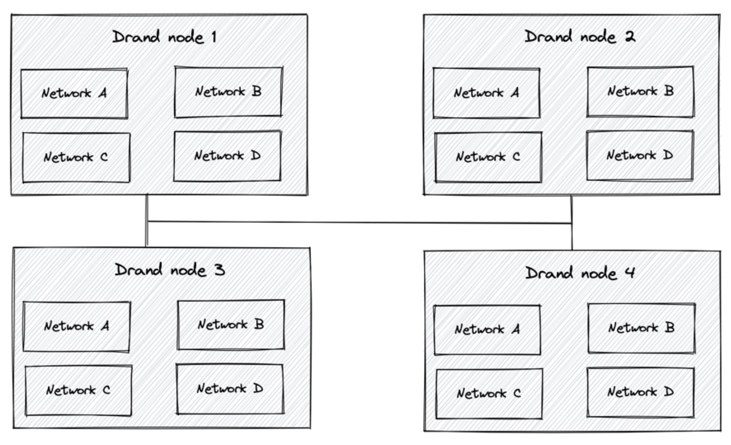
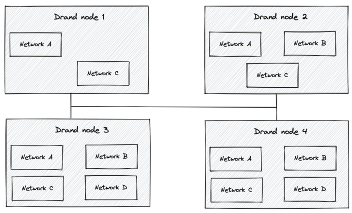
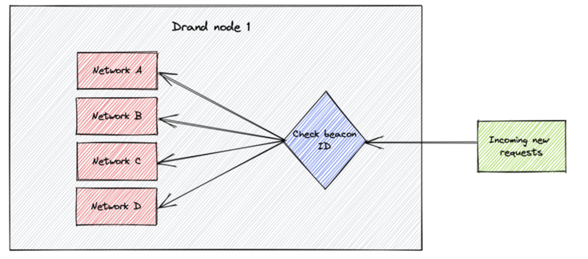
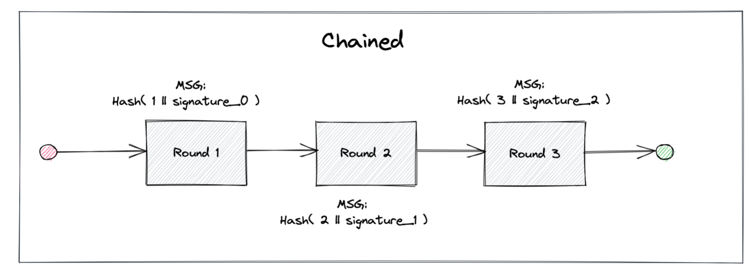
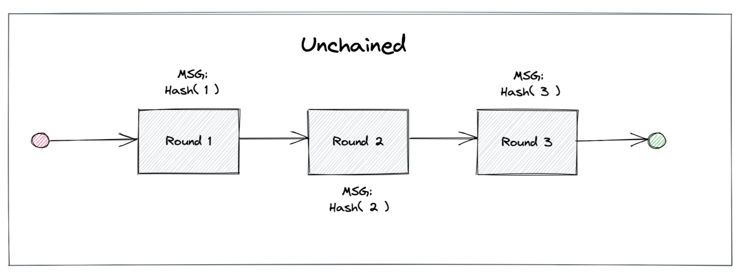
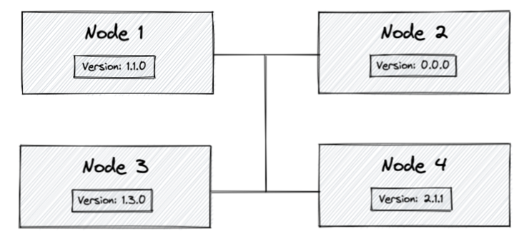

## Multi Chain Support 
Generating public randomness is the primary functionality of drand. Public randomness is generated collectively by 
drand nodes and is made publicly available. In the past, each node could only run one process which will generate random values. 
**We contributed to the project by adding support to run more than one of these processes at the same time**. Therefore, now each node can run 
multiple processes (i.e., participate in multiple networks) at the same time, each of which is independent of each other, 
with its own set of parameters. All processes use the same node address to send messages to and the node will 
identify and dispatch the request to the correct process/network (running internally) using an ID, known as the Beacon ID.

The following diagram explains visually the above operation.



In the above figure, each drand node is running 4 processes, i.e., participates in 4 different randomness generation networks. 
Each one of a node's processes communicates with the corresponding process running in the rest of the nodes, i.e., 
the process "Network A" in Node 1 communicates with the process "Network A" in nodes 2, 3 and 4, in order to achieve their 
common goal: generate public randomness. It is worth highlighting that not all nodes need to participate in all networks, i.e., 
run all existing processes. The following diagram shows this scenario.




Messages are delivered to the correct internal process by a module that checks the Beacon ID inside 
the request and redirecting the message accordingly.



## Unchained randomness
**Thanks to our contribution, drand network can now work in two different modes: chained or unchained.** In the past it only worked on chained mode. 

The drand randomness beacon operates in discrete rounds . In every round, drand produces a new random value using
threshold BLS signatures which can be linked together, or not, into a chain of randomness.

In chained mode, in order to extend the chain of randomness, each drand participant i creates its contribution using the signature from 
previous round and the actual round number. This process ensures that every new random value
depends on all previously generated signatures.



In unchained mode, in order to extend the chain of randomness, each drand participant i creates its contribution using only the actual round number.


## Node versioning
In the past, messages between nodes were not versioned. There was no way to identify the node version of each working node in the network, or 
handle possible breaking changes correctly. As messages didn't indicate node version, incoming requests to a node could not analyze and decide if
they could or could not be processed. **In our contribution, we added this nice feature. Now each request sent by a drand node will contain the 
actual drand protocol version that the node is using**. Drand uses semantic versioning (opens new window) as a versioning protocol. 
This has a clear purpose. Only nodes with same MAJOR version will be allowed to communicate with each other.
For backward-compatibility reasons, the fallback value will be 0.0.0, and nodes with this version will always be allowed 
to communicate with other nodes. The protobuf definition for this field is:

```go
message NodeVersion {
    uint32 major = 1;
    uint32 minor = 2;
    uint32 patch = 3;
}
```

**Notes**: The NodeVersion is present inside the Metadata field.

In the following diagram, we can see:

Node 2 will be able to interact the rest of the nodes.
Node 4 will be only able to interact with nodes whose version is 2.X.X. In this case, it cannot communicate with any other node.
Nodes 1 and 3 will be only able to interact with nodes whose version is 1.X.X. In this case, they can communicate with each other.



**Notes**: Node 2 is a node where node-versioning feature is not supported. This node has not been updated to the latest version (above 1.3). In this case, Metadata won't be present on requests, so the fallback version other nodes infer is 0.0.0.
