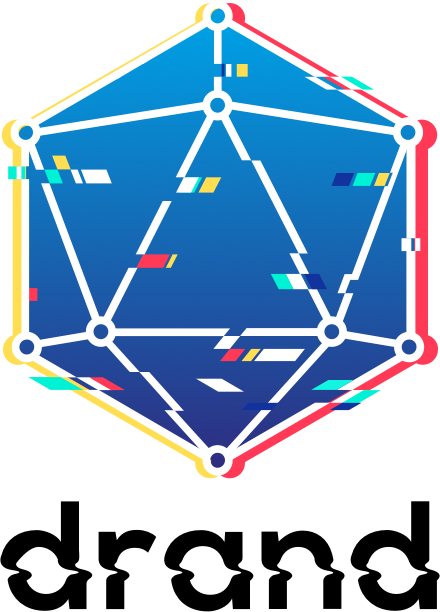

Drand is a distributed randomness beacon daemon written in Golang

Linked drand nodes collectively produce **publicly verifiable**,
**unbiased** and **unpredictable** random values at
fixed intervals using bilinear pairings and threshold cryptography.

Drand was first developed within the [DEDIS](https://github.com/dedis)
organization, and as of December 2019, is now under the drand organization.
